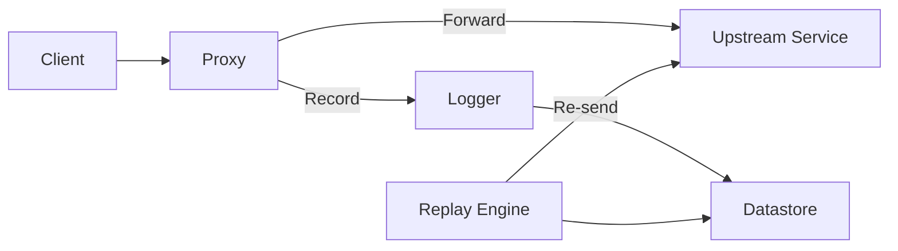

# Architecture

RWND is composed of a few simple pieces that work together:

## Proxy

The proxy sits in front of your backend, forwards traffic, and captures
request/response data.

Responsibilities:

- Accept incoming HTTP traffic
- Forward to the target
- Capture request/response bodies, headers, and status
- Send a record to the logger

## Logger

The logger assigns IDs and timestamps and writes records to a datastore.

Responsibilities:

- Assign incrementing IDs
- Timestamp records
- Write to a store asynchronously

## Datastore

The datastore stores logs for replay.

Current options:

- File store (JSONL)
- SQLite (WIP)

## Replay Engine

The replay engine reads records from a datastore and allows:

- Interactive stepping
- Replay for the current request
- Pretty printed output for requests and responses
